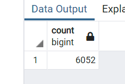
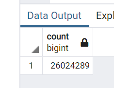

# Movies_ETL

## Resources
*   Software:
    *   Anaconda 4.11.0
    *   Jupyter Notebook 6.4.5
    *   Python 3.9.7
    *   PostgreSQL 14.1
    *   pgAdmin 4
    *   Visual Studio Code 1.63.2
*   Data
    *   wikipedia-movies.json
    *   movies_metadata.csv
    *   ratings.csv
        *   These .csv datasets are not available in this GitHub repository due to their file size being >100mbs. You can [click this link to download the zip for these datasets from kaggle.com (sign in required)](https://www.kaggle.com/account/login?titleType=dataset-downloads&showDatasetDownloadSkip=False&messageId=datasetsWelcome&returnUrl=%2Frounakbanik%2Fthe-movies-dataset%3Fresource%3Ddownload)

## Overview/Purpose

The goal of this project was to take movie data from both Wikipedia and Kaggle and create a database that can be used for analysis. To do this, the datasets were cleaned are parsed so they could be merged and moved to the PostgreSQL database via the extract, transform, and load (ETL) process.

## Results

After going though the ETL process, my database had two tables: movies and ratings. 

The movies table contained the expected 6,052 rows of data. This means that this table had the relative info (IMDB ID, title, runtime, overview, writer(s), etc.) for over 6,000 movies.

The ratings table contained the expected 26,024,289 rows of data. Each row represents a viewer rating of a specific movie.

## Summary 

This data is now in a format that will allow for much easier analysis of movie and ratings data by others! 